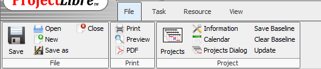

# 📅 MS Project & ProjectLibre Juhend

> Õppeveebileht, mis selgitab Microsoft Projecti ja ProjectLibre põhifunktsioone samm-sammult.  
> Veebileht on loodud HTML ja CSS abil ning avaldatud GitHub Pages kaudu.

---

## Sisukord

- [Projekti kirjeldus](#projekti-kirjeldus)
- [Failid](#failid)
- [Lisatud funktsionaalsused](#lisatud-funktsionaalsused)
- [Tehtud tööd](#tehtud-tööd)
- [Kasutatavad tehnoloogiad](#kasutatavad-tehnoloogiad)
- [Issues ja Kanban](#issues-ja-kanban)
- [Pildid](#pildid)
- [Lingid](#lingid)

---

## Projekti kirjeldus

See projekt on õppeveebileht, mis õpetab kasutama **Microsoft Project** ja **ProjectLibre** tarkvara.  
Projekt sisaldab kolme põhijuhendi:

1. Uue kalendri loomine MS Projectis / ProjectLibre's
2. Diagrammide loomine Projectis ja ProjectLibre's
3. Navigeerimismenüü kõigil lehtedel

---

## Failid

| Fail | Kirjeldus | Haru |
|------|-----------|------|
| `index.html` | Kalendri loomise juhend | `main` + `projectLibre` |
| `diagramm.html` | Diagrammide loomise juhend | `main` + `projectLibre` |
| `style.css` | Kõigi lehtede kujundus | `main` + `projectLibre` |
| `README.md` | Projekti kirjeldus | `main` + `projectLibre` |
| `valem.html` | Arvutusvälja juhend | ainult `main` (kustutatud `projectLibre` harus) |

> [!NOTE]
> `valem.html` fail eemaldati `projectLibre` harus, kuna ProjectLibre's ei ole eraldi arvutusvälja funktsiooni samal kujul nagu MS Projectis.

---

## Lisatud funktsionaalsused

### 📅 Kalender (`index.html`)
- Uue kalendri loomine MS Projectis ja ProjectLibre's
- Tööpäevade ja tööaegade muutmine
- Eripäevade lisamine (puhkused, riigipühad)
- Selgitus, kuidas kalender mõjutab projekti ajakava

### 📊 Diagrammid (`diagramm.html`)
- Gantt-diagrammi kasutamine MS Projectis
- Network Diagram (sõltuvuste vaade)
- Gantt-diagramm ja ressursidiagramm ProjectLibre's
- Diagrammi eksportimine PDF-i

### 🔗 Navigeerimismenüü
- Ühtne navigeerimismenüü kõigil lehtedel
- `projectLibre` harus: lingid Kalender ja Diagrammid (valem.html eemaldatud)

---

## Tehtud tööd

- [x] HTML struktuur loodud (`index.html`)
- [x] CSS kujundus lisatud (`style.css`)
- [x] Navigeerimismenüü lisatud kõigile lehtedele
- [x] `valem.html` loodud (`main` harus)
- [x] `diagramm.html` loodud ja täiendatud
- [x] Haru `projectLibre` loodud
- [x] `index.html` uuendatud ProjectLibre kalendri juhendiga
- [x] `diagramm.html` uuendatud ProjectLibre diagrammide juhendiga
- [x] `valem.html` kustutatud `projectLibre` harus
- [x] Navigeerimismenüü uuendatud (valem.html link eemaldatud)
- [x] Ekraanipildid lisatud kausta `images/`
- [x] Issues loodud (#1, #2, #3, #4, #5, #6, #7)
- [x] Kanban tahvel loodud ja issues hallatud
- [x] Issues seotud commit-sõnumitega
- [x] GitHub Pages avaldatud (`projectLibre` harust)
- [x] README.md koostatud mõlemas harus

---

## Kasutatavad tehnoloogiad

- **HTML5** — lehe struktuur ja sisu
- **CSS3** — kujundus (muutujad, flexbox, responsive disain)
- **Git** — versioonihaldus ja harude haldamine
- **GitHub Pages** — tasuta veebimajutus
- **ProjectLibre** — avatud lähtekoodiga projektihaldus tarkvara
- **Microsoft Project** — professionaalne projektihaldus tarkvara

### Näidis commit-sõnumid

```bash
# Haru loomine ja esimene commit
git checkout -b projectLibre
git add index.html
git commit -m "Lisa ProjectLibre kalendri juhend (Fixes #1)"

# Diagrammide lisamine
git add diagramm.html
git commit -m "Lisa diagrammide juhend ProjectLibre jaoks (Closes #2)"

# Navigeerimismenüü uuendamine
git add index.html diagramm.html
git commit -m "Uuenda navigeerimismenüüd, eemalda valem.html link (Closes #3)"

# Faili kustutamine
git rm valem.html
git commit -m "Kustuta valem.html projektLibre harust (Closes #4)"

# Pildid
git add images/
git commit -m "Lisa ekraanipildid kõigi sammude juurde (Closes #5)"

# README
git add README.md
git commit -m "Lisa README.md projectLibre harusse (Closes #6)"
```

---

## Issues ja Kanban

Projekti käigus loodi **7 issue'd**, mis hallati Kanban tahvlil.

### Issue-de nimekiri

| # | Pealkiri | Olek |
|---|----------|------|
| #1 | `index.html` faili uuendamine ProjectLibre jaoks | ✅ Done |
| #2 | Diagrammide loomise juhendi lisamine | ✅ Done |
| #3 | Navigeerimismenüü muutmine | ✅ Done |
| #4 | `valem.html` kustutamine `projectLibre` harust | ✅ Done |
| #5 | Ekraanipiltide lisamine kõigi sammude juurde | ✅ Done |
| #6 | README.md koostamine `projectLibre` harusse | ✅ Done |
| #7 | GitHub Pages seadistamine `projectLibre` harust | ✅ Done |

> [!TIP]
> Issues seotakse commit-sõnumitega märksõnade abil: `Fixes #1`, `Closes #2` jne.  
> Kui commit on peaharu sulandatud (merge), suletakse issue automaatselt.

> [!WARNING]
> Veendu, et kõik pildifailid asuvad kaustas `images/` enne GitHub Pages avaldamist — muidu kuvatakse tühjad kohad.

---

## Pildid

Kõik ekraanipildid asuvad kaustas `images/`:

```
images/
├── libre.png       — ProjectLibre avakuva / Change Working Time
├── libre_1.png     — Uue kalendri loomine
├── libre_2.png     — Tööaegade muutmine
├── libre_4.png     — Eripäevade lisamine
├── libre_5.png     — Kalendri kasutamine projektis
└── diagramm_1.png  — Gantt-diagramm
```



---

## Lingid

- 🌐 [Veebileht (GitHub Pages)](https://mariiaposvystak.github.io/GitHub_issues/)
- 💻 [GitHub repositoorium](https://github.com/mariiaposvystak/GitHub_issues)
- 📹 [Arvutusvälja video](https://www.youtube.com/watch?v=bP1Wi4wGlaw&t=367s)
- 📹 [Diagrammide video](https://www.youtube.com/watch?v=iTpoBlkR0OE)

---

[^1]: Juhend koostatud Microsoft Project 2019 ja ProjectLibre 1.9 põhjal.  
[^2]: GitHub Pages seadistamiseks: Settings → Pages → Source → vali haru `projectLibre` → Save.
